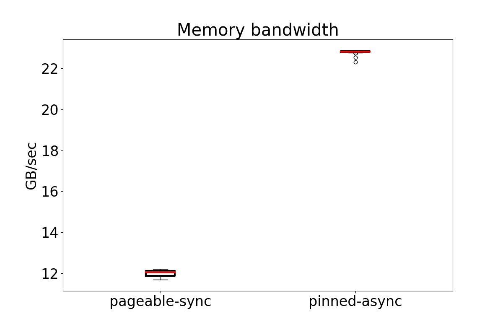

# Performance analysis of CUDA programs
## Introduction
This repository contains the source files to generate programs for the performance analysis of CUDA 
programs and to understand the impact of various best practices and optimization strategies.

## Sources
The source code is adapted from the following sources:
1. [Programming Massively Parallel Processors: A Hands-on Approach](https://www.amazon.de/Programming-Massively-Parallel-Processors-Hands/dp/0323912311/ref=pd_sbs_d_sccl_1_1/258-7195709-3042700?pd_rd_w=cTR1T&content-id=amzn1.sym.3c81483b-6678-478b-bd4a-9a0aedeab67e&pf_rd_p=3c81483b-6678-478b-bd4a-9a0aedeab67e&pf_rd_r=P4MA1KQXYDWQBC54D3DR&pd_rd_wg=VFzn8&pd_rd_r=776558d3-6fd9-4bc6-84ca-5a368a8274ce&pd_rd_i=0323912311&psc=1)
    , please check `pmpp` directory for further details.
2. [CUDA C++ Best Practices Guide](https://docs.nvidia.com/cuda/cuda-c-best-practices-guide/index.html)
    , please check `bpnv`.

## Installation

## Usage
```
    Usage: ./run_perf_tests -a <operation_name> -n <num_repetitions> -o <output_dir>
    -a <operation_name> : Name of the operation to be performed
    -n <num_repetitions> : Number of times the operation needs to be repeated.
    -o <output_dir> : Output directory name to save plots.
```
### Know your GPU
Before embarking on the performance analysis, it is important to know the GPU you are working with.
```
./run_perf_tests -a know-your-gpu
```
Here is the output that I got while running the program on my laptop:
```
Number of CUDA devices: 1
Properties for device 0:
Device ID: 0
Device name: NVIDIA GeForce RTX 3070 Laptop GPU
Compute capability: 8.6
Number of SMs (streaming multi-processor): 40
Maximum concurrent threads per device: 61440
Maximum active threads per SM: 1536
Maximum active threads per block: 1024
Maximum threads per warp: 32
Warp size: 32
Maximum blocks per SM: 16
Global memory size: 8361017344 bytes
Constant memory size: 65536 bytes
Maximum shared memory per SM: 102400 bytes
Maximum shared memory per block: 49152 bytes
Maximum registers per block: 65536 bytes 
Maximum registers per SM: 65536 bytes
Memory clock rate: 6001000 KHz
Memory bus width: 256 bits
Peak memory bandwidth: 384.064 GB/sec
Can map host memory?: Yes
L2 cache size: 4194304 bytes
```

### Memory Bandwidth
The following performance test analyzes the memory bandwidth 
of two major host-device memory transfer operations:
1. Synchronous data transfer from the pageable memory to the device memory.
2. Asynchronous data transfer from the pinned (page-locked) memory to the device memory.
```
./run_perf_tests -a mem-bandwidth -n 100
Memory bandwidth test: start
Data size: 67108864 bytes
Memory bandwidth test: end
```



As the plot shows, the performance of host-device data transfer
can be significantly enhanced by using pinned memory.


